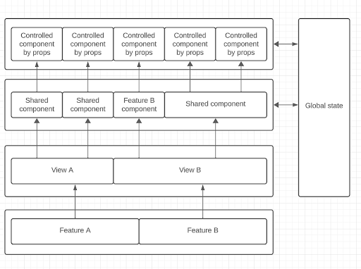
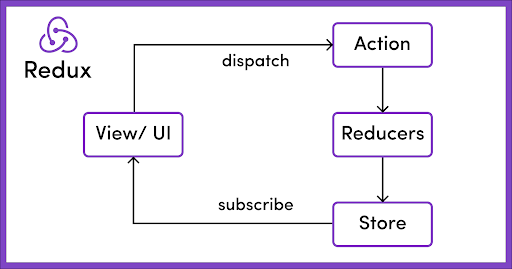

## State Management

Technology Review
Writer: Federico Castañares, Facundo Panizza

### An example of application layers

Defining how we are going to separate our application layers helps us maintain a clean architecture. The definition may vary depending on the solution we want to achieve, but we define an example:

{width="450px"}

In this example, we will have several features with their respective views. Each view can have shared or specific components for that feature. These components will control the state of the application, mutating them or simply reading them, using controlled components by props to render their content.

The state in this example can contain both data and UI state.

### Global state with Redux

**Pros:**

- Centralized global state. With Redux, we can store both our data and our UI in a single library.
- Debugging. With redux-devtools, we can see how our app is changing state, how, and when.
- Scalable. We can add and remove reducers while maintaining the structure.

**Cons:**

- Boilerplate. Considerable boilerplate is required for its implementation.
- Learning curve. It has complexity for understanding at the beginning.
- Verbosity. Redux can make your code more verbose, and for simple applications, the benefits might not outweigh the costs.

### Store Structure

One way to structure the store can be to respect the entities we have in our backend, having one reducer for each entity and adding to this a reducer per feature to handle the UI state of the same.

In this way, each reducer copy of an entity will be separate from each feature and can be reused.

{width="400px"}

### Controlled components by props

##### What they are and why make them controlled by props

These components receive their state and the function to change it through their props. This facilitates the reuse of components within our application; we just need to respect their interface.

**Pros:**

- They are easier components to maintain.
- They allow for greater reuse of them.
- They are good components to use with libraries for managing global states and also with libraries that help you manage forms.

**Cons:**

- If we have several nested components of this type, it can generate a lot of props drilling.

### useContext

It can be recommended if your application is small and you are going to handle very few states that are not very complex. Or if you want to have a state isolated from the rest of the states of your app.

**Pros:**

- It is simpler to use than more complex libraries like Redux.
- It does not require as much boilerplate code.
- It is a native feature of React.

**Cons:**

- It can limit you when you have a complex application.
- It is easy to make mistakes that render the entire application or many parts that you do not want to render again.
- It does not have any developer tools to view the current state of your application, such as Redux DevTools.
